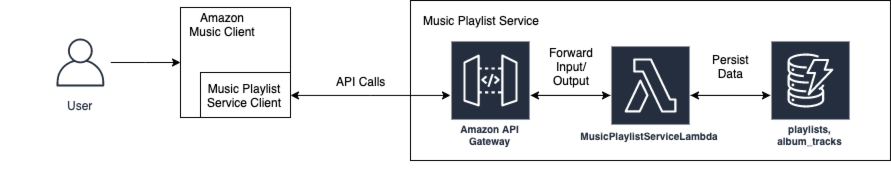
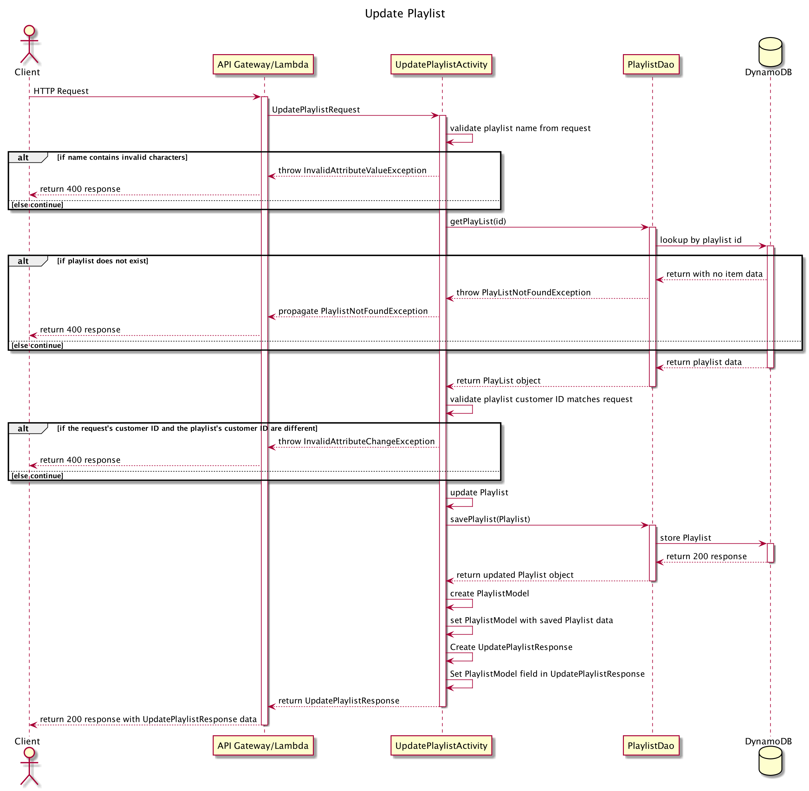
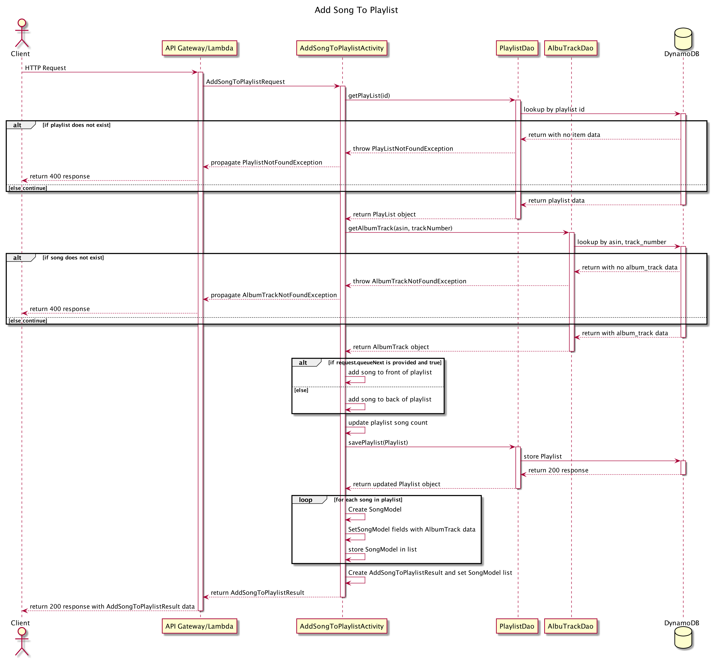
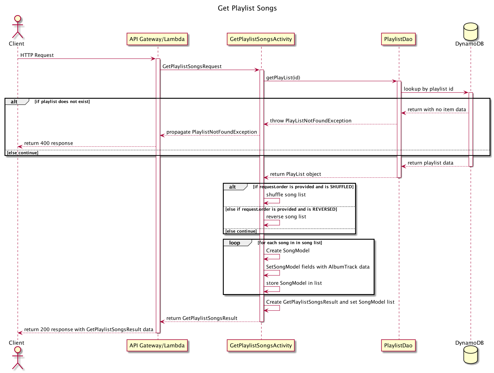

## Unit 3 Project Design Document

### Background

[Amazon Music Unlimited](https://www.amazon.com/b?ie=UTF8&node=15730321011)
is a premium music subscription service featuring tens of millions of songs
available to our millions of customers. We currently provide expert curated,
premade playlists, but customers have often requested the ability to create
and manage their own custom playlists.

This design document describes the Amazon Music Playlist Service, a new
AWS service that will provide the custom playlist functionality
to meet our customers’ needs. It is designed to interact with the Amazon
Music client and will return a list of song metadata associated with the
playlist that the Amazon Music client can use to fetch the song file when
playing.

This initial iteration will provide the minimum lovable product (MLP) defined
by our product team including creating, retrieving, and updating a playlist,
as well as adding to and retrieving a saved playlist’s list of songs.

### Glossary

* **Playlist** - Represents a customer’s playlist, an ordered collection of
  songs. Customers are able to give it a custom name. See Data Model for more
  information
* **Song/Song Metadata/Album Track** - We will use our sister team’s album
  information to represent song metadata. Represented as an ASIN that maps
  to the specific album, and a track number for a specific song on the album.
  See Data Model for more information
* **Tag** - User defined tags associated with a playlist for them to easily
  categorize the playlist. The tags will be used by another Amazon Music team
  to allow searching for playlists as well as searching for songs
* **ASIN** - Amazon Standard Identification Number*, *unique identifier for
  an amazon product, in this case a music album
* **DDB** - DynamoDB. An AWS service providing a database to save and load
  data to
* **MLP** - Minimum Lovable Product. The minimum set of features in our
  product to provide for customers to ensure they love our product
* **Customer ID** - unique identifier for a customer’s amazon account
* **Amazon Music Client** - Amazon Music’s client which the user interacts
  with to retrieve playlist data and play music

### Business Requirements

* As a customer, I want to create a new, empty playlist with a given name and
  a list  of tags.
* As a customer, I want to retrieve my playlist with a given ID.
* As a customer, I want to update my playlist name.
* As a customer, I want to add a song to the end of my playlist.
* As a customer, I want to add a song to the beginning of my playlist.
* As a customer, I want to retrieve all songs in my playlist, in a provided
  order (in order, reverse order, shuffled).

### Architecture



### Music Playlist Service API Implementation Notes

#### General

* We’ve created a starter service package with a basic implementation of the
  Get Playlists endpoint.
    * We’ve implemented a simple dependency management strategy with our
      `App` class, but we want to refactor it to use the
      [Dagger framework](https://dagger.dev/users-guide) so we no longer
      have to hand manage it.
* The client calling our service will be the Amazon Music Client, used in
  Amazon Music’s various products such as the website, mobile apps, or Alexa
  integration.
* The Amazon Music Client is responsible for logging the user in and passing
  the customer ID when calling the Music Playlist Service.
* Our team has also provided a `MusicPlaylistServiceUtils` class available
  that can help with validation and generating playlist IDs. It exposes the
  below methods:
    * `boolean isStringValid(String playlistName)`
    * `String generatePlaylistId()`
* There are 3 initial custom exceptions created for the Music Playlist
  service that can be thrown (as noted below):
    * `PlaylistNotFoundException`
    * `InvalidAttributeValueExcpetion`
    * `AlbumTrackNotFoundException`

Below are the endpoints required to provide the MLP business requirements

#### Get Playlist Endpoint

* Accepts `GET` requests to `/playlists/:id`
* Accepts a playlist ID to return the corresponding playlist for.
* If the given playlist ID is not found, will throw a `PlaylistNotFoundException`

#### Create Playlist Endpoint

* Accepts `POST` requests to `/playlists`
* Accepts data to create a new playlist with a provided name, a given customer
  ID, and an optional list of tags. Returns the new playlist, including a
  unique playlist ID assigned by the Music Playlist Service.
* We have a utility class with a validation method, and a method to generate
  a new, unique playlist ID.
* For security concerns, we will validate that the provided customer ID and
  playlist name do not contain any invalid characters: `" ' \ `
* If the customer ID or playlist name contains any of the invalid characters,
  will throw an `InvalidAttributeValueException`.
* This API *must* create the playlist with an empty list so we can later add
  songs to it through the subsequent APIs.
* We do not want to unnecessarily store duplicate tags, so we will choose a
  data structure that can provide us this behavior.
* The music playlist client will provide a non-empty list of tags or `null`
  in the request to indicate no tags were provided.
* Note: Unlike the playlist name, tags do not have any character restrictions.

#### Update Playlist Endpoint

* Accepts `PUT` requests to `/playlists/:id`
* Accepts data to update a playlist including a playlist ID, an updated
  playlist name, and the customer ID associated with the playlist. Returns
  the updated playlist.
* If the playlist ID is not found, will throw a `PlaylistNotFoundException`
* For now, only supports updating the playlist name. Don't modify any of
  the other attributes.
* For security concerns, we will validate that the provided customer ID and
  playlist name do not contain any invalid characters: `" ' \ `
* If the customer ID or playlist name contains any of the invalid characters,
  will throw an `InvalidAttributeValueException`.
* Note: We will not allow tags to be updated. The Music Search team using the
  tags are not ready to support updating them. If needed, this functionality
  can be added after launch.

#### Add Song To Playlist Endpoint

* Accepts `POST` requests to `/playlists/:id/songs`
* Accepts a playlist ID and a song to be added. The song is specified by the
  album’s ASIN and song track number
    * By default, will insert the new song to the end of the playlist
    * If the optional `queueNext` parameter is provided and is `true`, this
      API will insert the new song to the front of the playlist so that it
      will be the next song played
* If the playlist is not found, will throw a `PlaylistNotFoundException`
* If the given album ASIN doesn’t exist, or if the given track number does
  not exist for the album ASIN, will throw an `AlbumTrackNotFoundException`

#### Get Playlist Songs Endpoint

* Accepts `GET` requests to `/playlists/:id/songs`
* Retrieves all songs of a playlist with the given playlist ID
    * Returns the song list in default playlist order
    * If the optional `order` parameter is provided, this API will return the
      song list in order, reverse order, or shuffled order, based on the value
      of `order`
        * DEFAULT - same as default behavior, returns songs in playlist order
        * REVERSED - returns playlist songs in reversed order
        * SHUFFLED - returns playlist songs in a randomized order
* If the playlist ID is found, but contains no songs, the songs list will be
  empty
* If the playlist ID is not found, will throw a `PlaylistNotFoundException`

#### Data

* We have worked with our sister team to import a number of albums into a local
  table called `album_tracks` in order to start development.
* We have created two Java models to represent an item in the playlists and
  `album_tracks` tables
    *  `Playlist.java`
    *  `AlbumTrack.java`
* For simpler song list retrieval, we will store the list of songs directly
  in the playlists table, representing it in the Java model as a
  `List<AlbumTrack>`. This is known as
  [denormalizing data](https://en.wikipedia.org/wiki/Denormalization).
    * This meets our needs, but does have limitations. Based on the maximum
      size of an item in DynamoDB, we’ve calculated this allows us to store
      about 2500 songs in a single playlist, above the projected playlist size
      that customers will need in this phase, at the cost of having to store
      large items as we scale.
    * A forward-thinking approach is create a separate table in which each song
      in a playlist is represented by a distinct item in the table (which
      contains the playlist ID and song identifiers). This removes the
      limitation of songs in a playlist, but consumes more data (and thus cost)
      and includes more complexity to retrieve the playlist’s songs. We may
      migrate our data to this model in the future when we’re more certain of
      customer needs.

### Data Model

This section maps the attributes of our tables, with the corresponding DDB type.

```markdown
    playlists
  
    id // partition key, string
    name // string
    customerId // string
    songCount // number
    tags // stringSet
    songList // list
```

```markdown
    album_tracks
    asin // partition key, string
    track_number // sort key, number
    album_name // string
    song_title // string
```

Our sister team providing the song data has a different attribute naming format.
We will have to account for this in our Java models when interacting with the
copy of their table.

### Class Diagram


[Link to class diagram PUML file](src/resources/mastery-task1-music-playlist-CD.puml)

##### Get Playlist:

###### GetPlaylistRequest:
```json
{
  "id" : "PPT03"
}
```
Note: id is a path parameter. e.g. `/playlists/PPT03`

###### GetPlaylistResult:

```json
{
  "id" : "PPT03",
  "name" : "PPT03 playlist",
  "customerId" : "1",
  "songCount" : 0,
  "tags" : null
}
```

##### Create Playlist:

###### CreatePlaylistRequest:

```json
{
  "name" : "new playlist",
  "customerId" : "1",
  "tags" : ["new tag"]
}
```

###### CreatePlaylistResult:

```json
{
  "id" : "isdD3",
  "name" : "new playlist",
  "customerId" : "1",
  "songCount" : 0,
  "tags" : ["new tag"]
}
```

##### Update Playlist:

###### UpdatePlaylistRequest:

```json
{
  "id" : "PPT03",
  "name" : "Updated PPT03 playlist",
  "customerId" : "1"
}
```
Note: id is a path parameter. e.g. `/playlists/PPT03`

###### UpdatePlaylistResult:

```json
{
  "id" : "PPT03",
  "name" : "Updated PPT03 playlist",
  "customerId" : "1",
  "songCount" : 0,
  "tags" : ["PPT03"]
}
```

##### Add Song to Playlist:

###### AddSongToPlaylistRequest:

```json
{
  "id" : "PPT03",
  "asin" : "B019HKJTCI",
  "trackNumber" : 6,
  "queueNext" : false
}
```
Note: id is a path parameter and queueNext is a query parameter. e.g.
`/playlists/PPT03/songs?queueNext=true`

###### AddSongToPlaylistResult:

```json
[
  {
    "asin" : "B019HKJTCI",
    "trackNumber" : 6,
    "albumName" : "Dark Side of the Moon",
    "songTitle": "Money"
  }
]
```

##### Get Playlist Songs:

###### GetPlaylistSongsRequest:

```json
{
  "id" : "PPT03",
  "order" : "DEFAULT"
}
```

Note: `id` is a path parameter and `order` is a query parameter. e.g.
`/playlists/PPT03/songs?order=DEFAULT`

###### GetPlaylistSongsResult:

```json
[
  {
    "asin" : "B019HKJTCI",
    "trackNumber" : 6,
    "albumName" : "Dark Side of the Moon",
    "songTitle": "Money"
  }
]
```
### API Sequence Diagrams

#### Get Playlist:


[Link to get playlist sequence diagram PUML file](src/resources/mastery-task1-get-playlist-SD.puml)

#### Create Playlist:


[Link to create playlist sequence diagram PUML file](src/resources/mastery-task1-create-playlist-SD.puml)

#### Update Playlist:



[source](src/resources/documentation/UpdatePlaylistActivity.puml)

#### Add Song To Playlist:



[source](src/resources/documentation/AddSongToPlaylistActivity.puml)

#### Get Playlist Songs:



[source](src/resources/documentation/GetPlaylistSongsActivity.puml)
